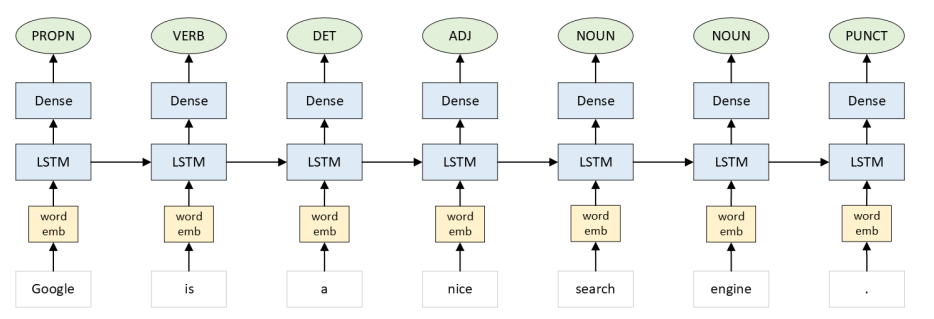

**README**

# Neural PoS Sequence Labeling Model

This repository contains an implementation of a neural part-of-speech (PoS) sequence labeling model using Long Short-Term Memory networks (LSTMs). The model is designed to label words in a sentence according to their morphological information, specifically focusing on the Universal Part-of-Speech (UPOS) tags.

| Input           | Output   |
|-----------------|----------|
| Google          | PROPN    |
| is              | AUX      |
| a               | DET      |
| nice            | ADJ      |
| search          | NOUN     |
| engine          | NOUN     |
| .               | PUNCT    |

**Figure 1:** Example input and output for part-of-speech tagging.

## Objective Summary

The task involves implementing a neural model that utilizes LSTM networks. The model architecture consists of a word-level embedding layer, followed by an LSTM layer, and a dense layer with softmax activation for label assignment. The model is trained on the English_EWT dataset from the Universal Dependencies collection. Additionally, the model is evaluated on both the validation/development and test sets provided in CoNLL-U format. Furthermore, the model is extended to support prediction of part-of-speech tags for newly inputted sentences by the user.

### Functionalities

1. **Training**: Train the model to convergence using the provided training data.
2. **Evaluation**: Evaluate the trained model on the validation/development and test sets, providing tagging accuracy metrics.
3. **Prediction**: Develop a function to compute part-of-speech tags for new sentences entered by the user.

## Dataset

The model is trained and evaluated on the English_EWT dataset from the Universal Dependencies collection. The dataset includes training, development, and test files represented in CoNLL-U format. The UPOS column is used for predicting morphological information.

## Model Architecture

The used architecture includes:
- Word-level embeddings
- LSTM layer
- Dense layer with softmax activation



**Figure 2:** Schema of model architecture.

## Preprocessing

Sentences longer than 128 words and multiwords are preprocessed and removed during the training and evaluation of the models to simplify processing.

## Usage

Clone the repository:

   ```bash
   git clone https://github.com/marcinjedrzejowski/PoS-Tagger.git
   ```
